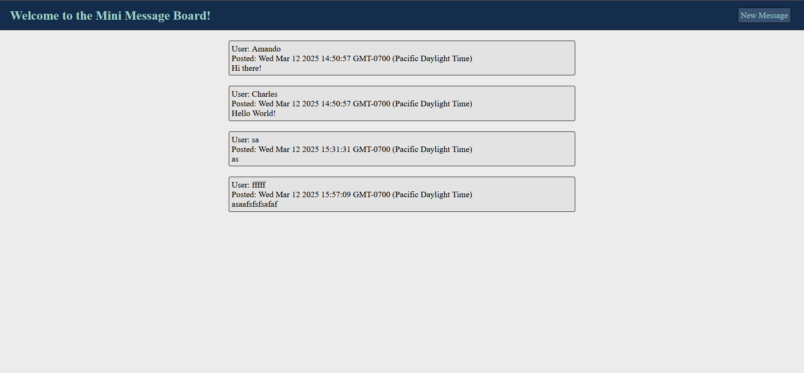
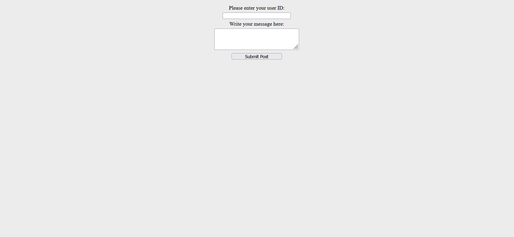

# Installation
For those who would like to run the application and/or edit its source code on their local computer, follow the steps below:

1. Clone the repository with `git clone https://github.com/Jaime-Sanz/Mini-Message-Board` or download it as a .zip file and extract it.

# Usage
- A simple message board built following The Odin Project’s backend module, focusing on basic functionality and message posting.

# Preview

| Webpage Screenshot |
| --- |
|  |

# Built Using
> 

# Contributing
Feel free to submit an issue should a bug be found using the application.

# Disclaimer
This game is independently created and is not affiliated with or endorsed by Riot Games. All trademarks and copyrights associated with League of Legends are the property of Riot Games. This project is purely for entertainment and educational purposes.
# License
[MIT License](https://github.com/Jaime-Sanz/Weather-Today/blob/main/LICENSE)
# Contact Info
> Send a message by clicking on the icon!
> 
> 
